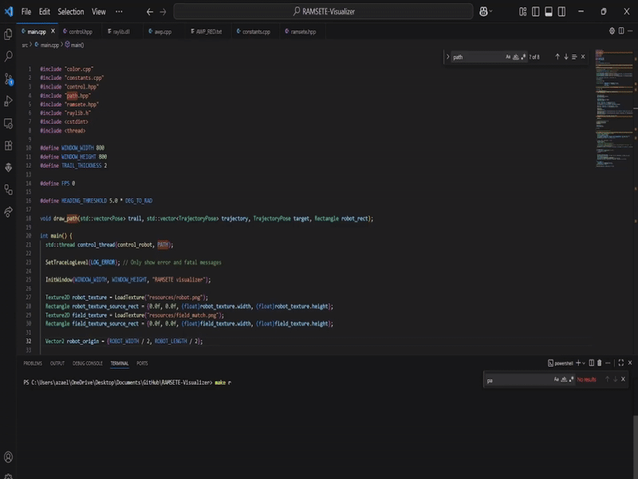

# RAMSETE Path Following Visualizer

A real-time tool for testing and tuning RAMSETE path-following algorithms for differential drive robots. Simulates robot motion with accurate kinematics and provides a visual interface for path tracking and tuning.




## Features
- Real-time RAMSETE controller simulation  
- Live path tracking (planned vs actual)  
- Optional motor acceleration & RPM limits  
- Multi-threaded control & rendering  
- CSV path loading for Path Planner at: (https://path.jerryio.com)  
- Interactive pause/tuning controls  
- Node-based waypoints (rotate/reverse support)  

## Project Structure
```
src/        # Core simulation and control code
paths/      # Path behaviors & CSVs
resources/  # Robot sprite & field background
Makefile
```

## Dependencies
- Raylib — see [Raylib GitHub Releases](https://github.com/raysan5/raylib/releases)  
- C++17  


## Build & Run
```bash
make      
make run
make clean 
```
## NOTE:
```
TUNE YOUR ACCELERATION AND RPM SPEEDS ACCORDINGLY IN THE PATH PLANNER SO THAT IT IS COMPATIBLE WITH THE MOTOR'S SLEW RATE, RERUN MANY TIMES UNTIL YOU GET THE BEST OUTCOME 
```


## Usage
- **Run** — `make run`  
- **Pause/Resume** — Press SPACE  
- **Nodes** — Blue circles with numbers  
-**Color** — Color is based on RPM Acceleration

**Configure paths** in `src/control.hpp`:
```cpp
#include "paths/your_path.cpp"
std::vector<int> rotating_indices = {4, 9, 13}; // when you want to rotate
std::vector<int> reverse_indices  = {6, 7}; // when you want to reverse
```
### Starting Node Configuration

Configure where the robot begins on the path by modifying `src/control.hpp`:
```cpp
#define STARTING_NODE 1  // Start from node 1 (default)
#define STARTING_NODE 5  // Start from node 5 (skip to middle of path)
```

**Tune parameters** in `constants.cpp`:
```cpp
#define TRACK_WIDTH_M 0.381 // in meters
#define WHEEL_RADIUS_M 0.0508 // in meters
#define MAX_SPEED_OUTPUT 600.0 // in RPM
```
**Tune parameters** in `ramsete.cpp`:
```cpp
#define B 2.0 // AGGRESIVENESS FACTOR
#define ZETA 0.7 //  DAMPING FACTOR
```


## Real Robot Deployment
Use:
- `ramsete.hpp`
- `path.hpp`
- `motor.hpp`
- `constants.hpp`
- `control.hpp`  

Remove:
- `main.cpp`  
- `color.cpp`  
- Raylib dependencies
